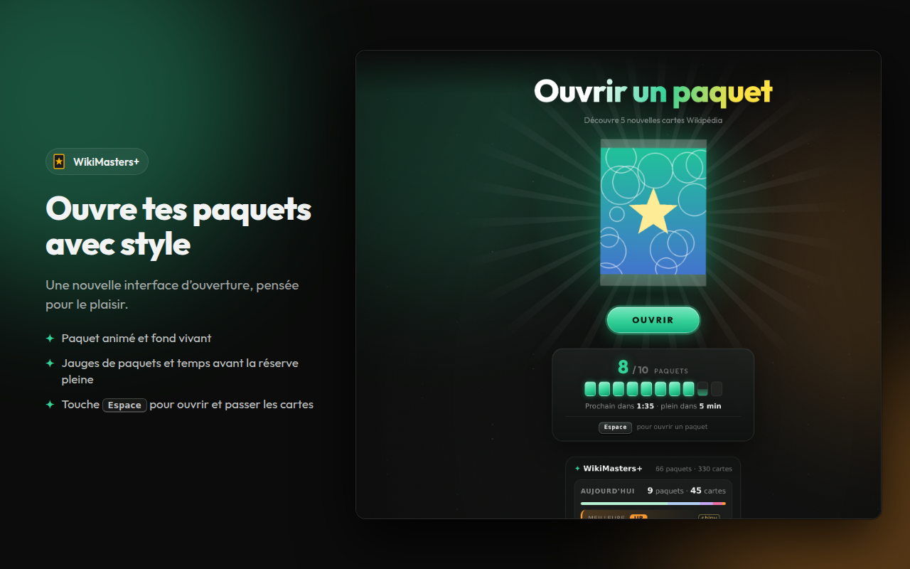

# WikiMasters+

Extension Chrome **non officielle** qui améliore l'expérience sur [wiki-masters.com](https://www.wiki-masters.com) : révélé des cartes animé, statistiques de tirages, pose de tags en un clic, outils sur les cartes et chargement plus rapide des pages.

> WikiMasters+ n'est ni affiliée ni approuvée par WikiMasters. Elle n'automatise pas l'ouverture des paquets et ne contourne aucune protection du site.



## Fonctionnalités

### Ouverture des paquets
- Nouvelle interface d'ouverture : fond animé, paquet flottant, compteur de paquets avec jauges et temps avant la réserve pleine.
- Effets de révélé **carte par carte**, sans spoiler : chaque rareté a sa mise en scène (silhouette qui se charge pour les Super Rares, montée en tension puis explosion pour les Ultra Rares et Légendaires, reflet arc-en-ciel pour les shiny).
- Étiquette « NOUVELLE » quand tu tires une carte que tu n'avais pas.
- Récap du paquet une fois toutes les cartes vues.
- Raccourci **Espace** : ouvrir un paquet, puis passer à la carte suivante (un appui = une action).

### Tags
- Barre de tags à côté de la carte pendant le révélé : un clic (ou les touches **1 à 9**) pose ou retire un tag, sans ouvrir la carte.
- Création d'un nouveau tag directement depuis la barre.

### Statistiques
- Panneau sur la page des paquets : bilan du jour, taux de drop réels par rareté, cartes ouvertes, séries sans L / UR / SR / shiny, derniers paquets.
- Popup avec l'historique détaillé et un export CSV.

### Outils sur les cartes
- Boutons **Wikipédia** et **Letterboxd** (films, acteurs, réalisateurs, via Wikidata).
- **Plein écran** : rendu net de la carte, inclinaison 3D.
- **Copie** de la carte en image dans le presse-papier.
- Image **sous licence libre** (Wikipédia, Wikidata, Commons) pour les cartes qui n'en ont pas, avec le crédit de l'auteur.
- Cartes visibles directement sur la page des **échanges**.
- **Vue compacte** sur Collection et Toutes les cartes.

### Confort
- Compteur de paquets dans le titre de l'onglet et sur l'icône de l'extension.
- Notification quand la réserve de paquets est pleine, rappel du pack PRO quotidien.
- **Cache local** des données lentes (collection, tags, cartes, amis, profils) : affichage instantané puis mise à jour automatique. Bouton **« Tout mettre en cache »** sur la Collection pour la précharger entièrement. Jamais pour les échanges, le marché ou les paquets, et vidé à chaque modification.

Chaque fonctionnalité peut être désactivée dans l'onglet **Réglages** du popup.

## Installation

### Depuis le Chrome Web Store
*(lien à ajouter après publication)*

### Manuellement (mode développeur)
1. Télécharge la dernière version dans [Releases](../../releases) et dézippe-la, ou clone ce dépôt.
2. Ouvre `chrome://extensions` et active le **Mode développeur**.
3. Clique sur **Charger l'extension non empaquetée** et choisis le dossier `extension`.

## Confidentialité

Tout reste dans ton navigateur. L'extension n'envoie aucune donnée à son auteur ni à un serveur tiers. Détails dans [PRIVACY.md](PRIVACY.md).

## Développement

```
extension/        code de l'extension (Manifest V3, sans étape de build)
  manifest.json
  background.js   service worker : alarmes, notifications, badge, historique
  inject.js       observation des réponses d'ouverture + cache local (contexte de la page)
  content.js      effets de révélé, compteur, raccourcis
  stage.js        interface d'ouverture et de révélé
  panel.js        panneau de statistiques sur la page
  tags.js         barre de tags pendant le révélé
  cards.js        outils sur les cartes, images libres, échanges, vue compacte
  popup.*         popup (stats, historique, réglages)
  lib/            html-to-image (MIT)
store/            textes et visuels du Chrome Web Store
scripts/          outils (création du zip)
```

Créer le zip à envoyer sur le Chrome Web Store :

```bash
./scripts/package.sh
```

## Crédits

- Rendu des cartes en image : [html-to-image](https://github.com/bubkoo/html-to-image) (licence MIT).
- Images et données : Wikipédia, Wikidata et Wikimedia Commons, sous leurs licences respectives (crédits affichés sur chaque image).

## Licence

[MIT](LICENSE)
